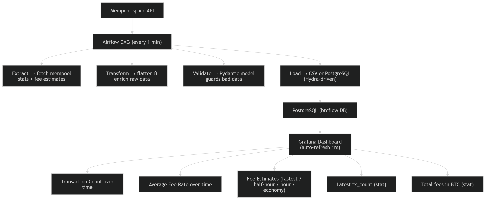

> A production-grade ETL pipeline built with Apache Airflow 3.x, Docker, and Grafana.

## Overview

**bitcoin-flow** streams live Bitcoin mempool data from [mempool.space](https://mempool.space) every minute, transforms it into structured records, validates them with Pydantic, and loads them into PostgreSQL — visualized in real-time via a Grafana dashboard.

---

## Stack

| Layer | Technology |
|---|---|
| Orchestration | Apache Airflow 3.x |
| Config | Hydra + OmegaConf |
| Validation | Pydantic v2 |
| Storage | PostgreSQL 15 + CSV |
| Visualization | Grafana 11 |
| Packaging | UV + pyproject.toml |
| Containerization | Docker + Docker Compose |
| Task Runner | Taskfile |
| Testing | pytest |

---
